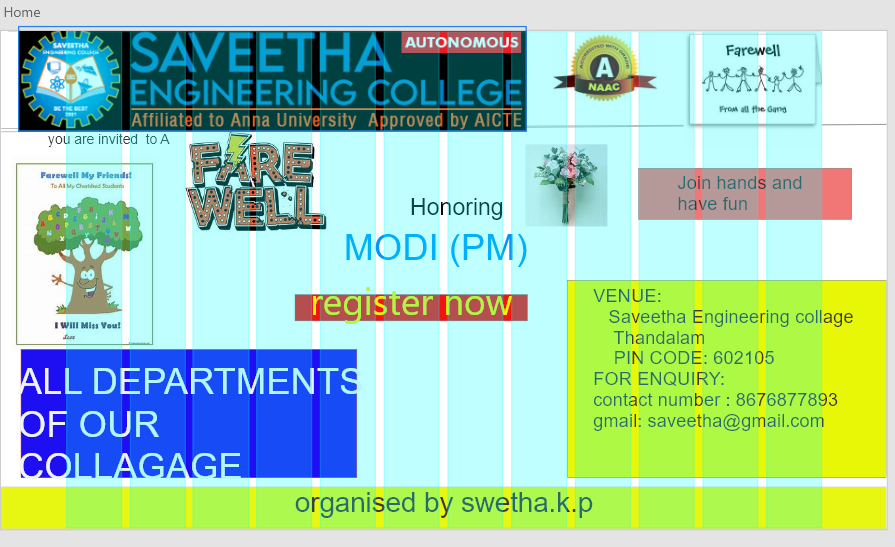
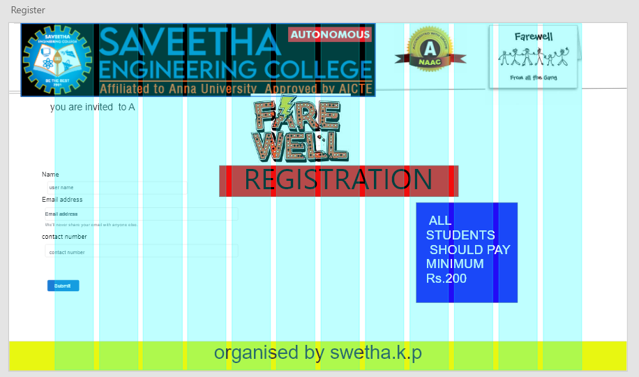
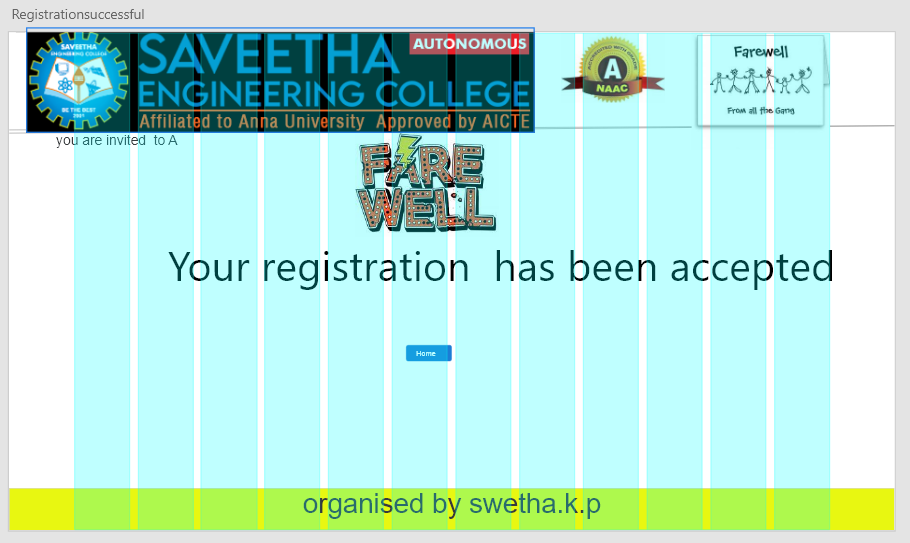
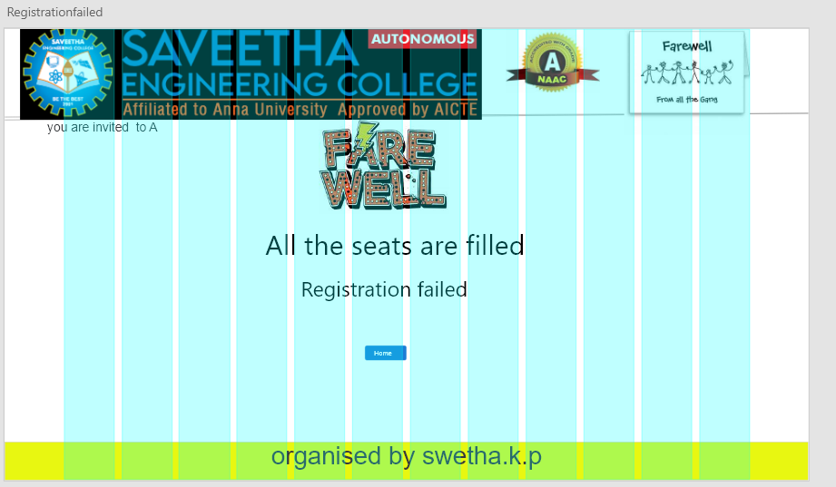
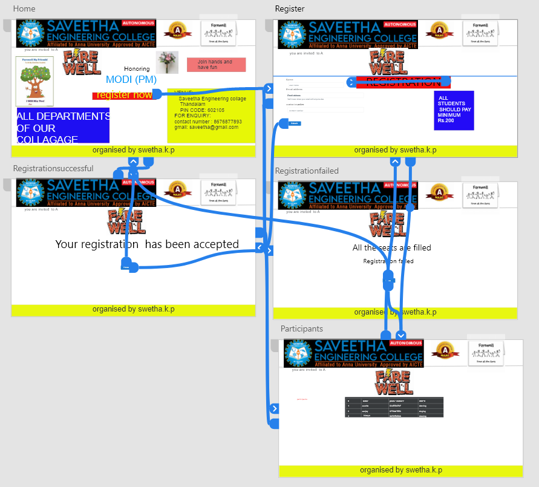
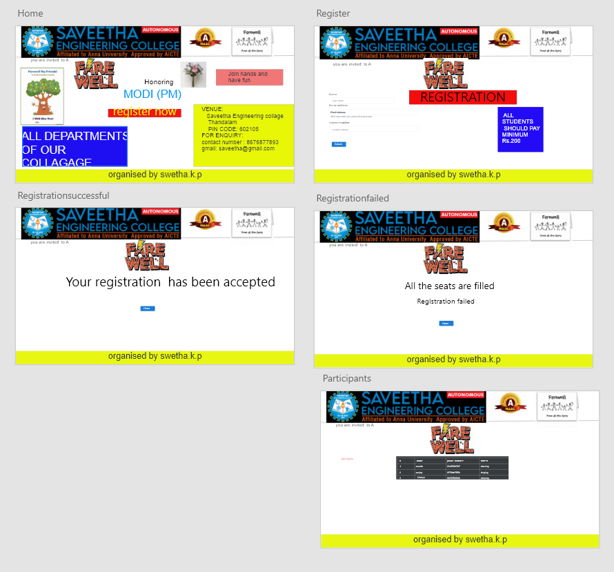

# WebApplication for Event Registration

## AIM:
To create a UX design and develop a web application for event registration.


## DESIGN SCREENS:






## WIREFRAME:



## PROTOTYPE:



## PROGRAM:
### home.html
```
<!doctype html>
<html lang="en">
  <head>
    <!-- Required meta tags -->
    <meta charset="utf-8">
    <meta name="viewport" content="width=device-width, initial-scale=1, shrink-to-fit=no">

    <!-- Bootstrap CSS -->
    <link rel="stylesheet" href="https://maxcdn.bootstrapcdn.com/bootstrap/4.0.0/css/bootstrap.min.css" integrity="sha384-Gn5384xqQ1aoWXA+058RXPxPg6fy4IWvTNh0E263XmFcJlSAwiGgFAW/dAiS6JXm" crossorigin="anonymous">

    <title>Saveetha Engineering College</title>
  </head>
  <body>
<div class="jumbotron">
    <div class="container">
  <h1 class="display-4">Algorithm</h1>
  <p class="lead">Department of Artificial intelligence</p>
  <hr class="my-4">
  <p>join us have a fun</p>
  <p class="lead">
    <a class="btn btn-primary btn-lg" href="#" role="button">Learn more</a>
  </p>
  </div>
</div>
<div class="container">
    <div class="row">
        <div class="col-12">
            <h1>Farewell party</h1>
        </div>
    </div>
    <div class="row">
        <div class="col-12 text-center">
            <a href="/register/" class="btn btn-primary btn-lg" role="button" >Register</a>
        </div>
    </div>
</div>

    <!-- Optional JavaScript -->
    <!-- jQuery first, then Popper.js, then Bootstrap JS -->
    <script src="https://code.jquery.com/jquery-3.2.1.slim.min.js" integrity="sha384-KJ3o2DKtIkvYIK3UENzmM7KCkRr/rE9/Qpg6aAZGJwFDMVNA/GpGFF93hXpG5KkN" crossorigin="anonymous"></script>
    <script src="https://cdnjs.cloudflare.com/ajax/libs/popper.js/1.12.9/umd/popper.min.js" integrity="sha384-ApNbgh9B+Y1QKtv3Rn7W3mgPxhU9K/ScQsAP7hUibX39j7fakFPskvXusvfa0b4Q" crossorigin="anonymous"></script>
    <script src="https://maxcdn.bootstrapcdn.com/bootstrap/4.0.0/js/bootstrap.min.js" integrity="sha384-JZR6Spejh4U02d8jOt6vLEHfe/JQGiRRSQQxSfFWpi1MquVdAyjUar5+76PVCmYl" crossorigin="anonymous"></script>
  </body>
</html>
```
### register.html
```
<!doctype html>
<html lang="en">

<head>
    <!-- Required meta tags -->
    <meta charset="utf-8">
    <meta name="viewport" content="width=device-width, initial-scale=1, shrink-to-fit=no">

    <!-- Bootstrap CSS -->
    <link rel="stylesheet" href="https://maxcdn.bootstrapcdn.com/bootstrap/4.0.0/css/bootstrap.min.css"
        integrity="sha384-Gn5384xqQ1aoWXA+058RXPxPg6fy4IWvTNh0E263XmFcJlSAwiGgFAW/dAiS6JXm" crossorigin="anonymous">

    <title>Saveetha Engineering College</title>
</head>

<body>
    <div class="jumbotron">
        <div class="container">
            <h1 class="display-4"> Farewell party</h1>
            <form action="/register/" method='POST'>
                
            <p class="lead">This is a simple hero unit, a simple jumbotron-style component for calling extra attention
                to featured content or information.</p>
            <hr class="my-4">
            <p>Department of Articial intelliance</p>
            <p class="lead">
                <a class="btn btn-primary btn-lg" href="#" role="button">Learn more</a>
            </p>
        </div>
    </div>
    <div class="container">
        <div class="row">
            <div class="col-12">
                <h1>Application</h1>
            </div>


        </div>
        <form>
            <div class="form-group">
                <label for="Name">Name</label>
                <input type="Name" class="form-control" name="Name" id="Name" placeholder=" Your Name">
            </div>
            <div class="form-group">
                <label for="Email1">Email Address</label>
                <input type="email" class="form-control" name="Email1" id="Email1" placeholder="Your email">
                <small id="emailHelp" class="form-text text-muted">We'll never share your email address with anyone
                    else.</small>
            </div>
            <div class="form-group">
                <label for="Phone">Contact Number:</label>
                <input type="phone" class="form-control" name="Phone" id="Phone" placeholder=" Your Phone">
            </div>
            <button type="submit" class="btn btn-primary">Submit</button>
        </form>


    </div>
    </div>

    </div>


    <!-- Optional JavaScript -->
    <!-- jQuery first, then Popper.js, then Bootstrap JS -->
    <script src="https://code.jquery.com/jquery-3.2.1.slim.min.js"
        integrity="sha384-KJ3o2DKtIkvYIK3UENzmM7KCkRr/rE9/Qpg6aAZGJwFDMVNA/GpGFF93hXpG5KkN"
        crossorigin="anonymous"></script>
    <script src="https://cdnjs.cloudflare.com/ajax/libs/popper.js/1.12.9/umd/popper.min.js"
        integrity="sha384-ApNbgh9B+Y1QKtv3Rn7W3mgPxhU9K/ScQsAP7hUibX39j7fakFPskvXusvfa0b4Q"
        crossorigin="anonymous"></script>
    <script src="https://maxcdn.bootstrapcdn.com/bootstrap/4.0.0/js/bootstrap.min.js"
        integrity="sha384-JZR6Spejh4U02d8jOt6vLEHfe/JQGiRRSQQxSfFWpi1MquVdAyjUar5+76PVCmYl"
        crossorigin="anonymous"></script>
</body>

</html>
```
### Success.html
```
<!doctype html>
<html lang="en">
  <head>
    <!-- Required meta tags -->
    <meta charset="utf-8">
    <meta name="viewport" content="width=device-width, initial-scale=1, shrink-to-fit=no">

    <!-- Bootstrap CSS -->
    <link rel="stylesheet" href="https://maxcdn.bootstrapcdn.com/bootstrap/4.0.0/css/bootstrap.min.css" integrity="sha384-Gn5384xqQ1aoWXA+058RXPxPg6fy4IWvTNh0E263XmFcJlSAwiGgFAW/dAiS6JXm" crossorigin="anonymous">

    <title>Saveetha Engineering College</title>
  </head>
  <body>
    <div class="jumbotron">
        <div class="cotainer">
            <h1 class="display-4">Farewell party</h1>
            <p class="lead">Turn Yourself to our bit</p>
            <hr class="my-4">
            <p>Department of Artificial intelligence.</p>
            <p class="lead">
            <a class="btn btn-primary btn-lg" href="#" role="button">Learn more</a>
            </p>
        </div>
    </div>
    <div class="container">
        <div class="row">
            <div class="col-12 text-center">
                <h1>We will contact you</h1>
                <div class="col-12 text-center">
                    <a href="/home" class="btn btn-primary btn-lg" role="button" aria-disabled="true">Back To MainPage</a>
                </div><div class="text-center">
                    <div class="alert alert-success" role="alert">
                        <h4 class="alert-heading">Congratulations!</h4>
                        <p>Your Registration is successful</p>
                        <hr>
                        <h4 class="alert-heading">Thank You.</h4>
                        </div>
                    </div>
                </div>

    <!-- Optional JavaScript -->
    <!-- jQuery first, then Popper.js, then Bootstrap JS -->
    <script src="https://code.jquery.com/jquery-3.2.1.slim.min.js" integrity="sha384-KJ3o2DKtIkvYIK3UENzmM7KCkRr/rE9/Qpg6aAZGJwFDMVNA/GpGFF93hXpG5KkN" crossorigin="anonymous"></script>
    <script src="https://cdnjs.cloudflare.com/ajax/libs/popper.js/1.12.9/umd/popper.min.js" integrity="sha384-ApNbgh9B+Y1QKtv3Rn7W3mgPxhU9K/ScQsAP7hUibX39j7fakFPskvXusvfa0b4Q" crossorigin="anonymous"></script>
    <script src="https://maxcdn.bootstrapcdn.com/bootstrap/4.0.0/js/bootstrap.min.js" integrity="sha384-JZR6Spejh4U02d8jOt6vLEHfe/JQGiRRSQQxSfFWpi1MquVdAyjUar5+76PVCmYl" crossorigin="anonymous"></script>
  </body>
</html>
```
### failed.html
```
<!doctype html>
<html lang="en">
  <head>
    <!-- Required meta tags -->
    <meta charset="utf-8">
    <meta name="viewport" content="width=device-width, initial-scale=1, shrink-to-fit=no">

    <!-- Bootstrap CSS -->
    <link rel="stylesheet" href="https://maxcdn.bootstrapcdn.com/bootstrap/4.0.0/css/bootstrap.min.css" integrity="sha384-Gn5384xqQ1aoWXA+058RXPxPg6fy4IWvTNh0E263XmFcJlSAwiGgFAW/dAiS6JXm" crossorigin="anonymous">

    <title>Saveetha Engineering College</title>
  </head>
  <body>
    <div class="jumbotron">
        <div class="cotainer">
            <h1 class="display-4">Algorythm</h1>
            <p class="lead">Turn yourself to our bit</p>
            <hr class="my-4">
            <p class="text-center">Department of Artificial intelligence</p>
            <p class="lead">
            <a class="btn btn-primary btn-lg" href="#" role="button">Learn more</a>
            </p>
        </div>
    </div>
    <div class="container">
        <div class="row">
            <div class="col-12 text-center">
                <h1>Woops!</h1>
                <div class="col-12 text-center">
                    <a href="/home" class="btn btn-primary btn-lg" role="button" aria-disabled="true">Back TO MainPage</a>
                </div><div class="text-center">
                    <div class="alert alert-success" role="alert">
                        <h4 class="alert-heading">Sorry!</h4>
                        <p>All seats are booked.</p>
                        </div>
                    </div>
                </div>

    <!-- Optional JavaScript -->
    <!-- jQuery first, then Popper.js, then Bootstrap JS -->
    <script src="https://code.jquery.com/jquery-3.2.1.slim.min.js" integrity="sha384-KJ3o2DKtIkvYIK3UENzmM7KCkRr/rE9/Qpg6aAZGJwFDMVNA/GpGFF93hXpG5KkN" crossorigin="anonymous"></script>
    <script src="https://cdnjs.cloudflare.com/ajax/libs/popper.js/1.12.9/umd/popper.min.js" integrity="sha384-ApNbgh9B+Y1QKtv3Rn7W3mgPxhU9K/ScQsAP7hUibX39j7fakFPskvXusvfa0b4Q" crossorigin="anonymous"></script>
    <script src="https://maxcdn.bootstrapcdn.com/bootstrap/4.0.0/js/bootstrap.min.js" integrity="sha384-JZR6Spejh4U02d8jOt6vLEHfe/JQGiRRSQQxSfFWpi1MquVdAyjUar5+76PVCmYl" crossorigin="anonymous"></script>
  </body>
</html>
```
### listofpartcipants.html
```
<!doctype html>
<html lang="en">

<head>
    <!-- Required meta tags -->
    <meta charset="utf-8">
    <meta name="viewport" content="width=device-width, initial-scale=1, shrink-to-fit=no">

    <!-- Bootstrap CSS -->
    <link rel="stylesheet" href="https://maxcdn.bootstrapcdn.com/bootstrap/4.0.0/css/bootstrap.min.css"
        integrity="sha384-Gn5384xqQ1aoWXA+058RXPxPg6fy4IWvTNh0E263XmFcJlSAwiGgFAW/dAiS6JXm" crossorigin="anonymous">

    <title>Saveetha Engineering College</title>
</head>

<body>
    <div class="jumbotron">
        <div class="container">
             <h1 class="display-4 text-center">Algorythm</h1>
            <p class="lead text-center">Tune yourself to our bit.</p>
            <hr class="my-4">
            <p class="text-center">Department of Artificial Intelligence and Data Science</p>
            <p class="lead text-center">
                <a class="btn btn-primary btn-lg" href="#" role="button">Learn more</a>
            </p>
        </div>
    </div>
    <div class="container">
        <div class="row">
            <div class="col-12">
                <h1>Participants List</h1>
            </div>
        </div>
        <div class="row">
            <div class="col-12">
                <table class="table">
                    <thead>
                        <tr>
                            <th scope="col">NAME</th>
                            <th scope="col">EMAIL</th>
                            <th scope="col">PHONE</th>
                        </tr>
                    </thead>
                    <tbody>

                        <tr>
                            <td>swetha.k.p</td>
                            <td>swethakp@gmail.com</td>
                            <td>9618146729</td>
                        </tr>

                        <tr>
                            <td>Surya</td>
                            <td>Surya@gmail.com</td>
                            <td>8074030772</td>
                        </tr>

                        <tr>
                            <td>ragav</td>
                            <td>ragav@gmail.com</td>
                            <td>1236789054</td>
                        </tr>

                        <tr>
                            <td>safa</td>
                            <td>safa88@gmail.com</td>
                            <td>5678065432</td>
                        </tr>

                        <tr>
                            <td>uma</td>
                            <td>uma22@</td>
                            <td>1238087687</td>
                        </tr>

                        <tr>
                            <td>Sanjay</td>
                            <td>Sanjay@gmail.com</td>
                            <td>1435687665</td>
                        </tr>

                        <tr>
                            <td>presetha</td>
                            <td>presi32@gmail.com</td>
                            <td>2233654328</td>
                        </tr>

                        <tr>
                        <tr>
                            <td>tamizh</td>
                            <td>tamizh03@gmail.com</td>
                            <td>9032460772</td>
                        </tr>

                        <tr>
                            
```                            


## OUTPUT:


## RESULT:
This UX design is created and a web application is developed fopr event registration in the URL http://swetha.student.saveetha.in:8000/home/
